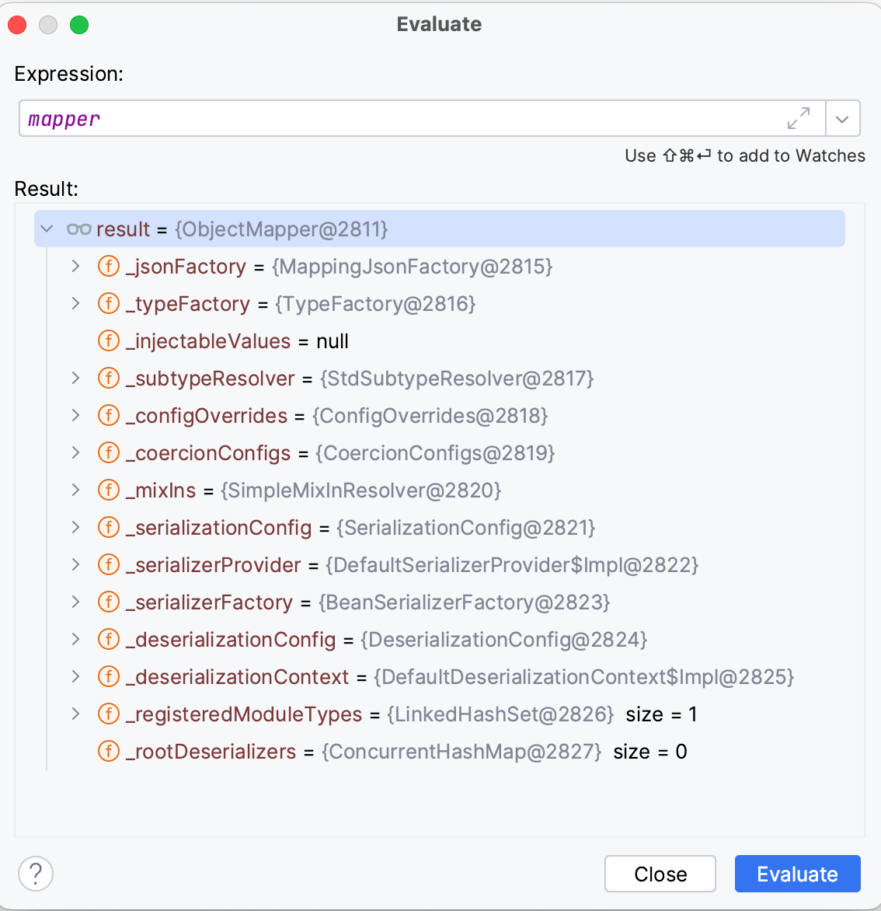

# Why you should reuse Jackson's ObjectMapper

As freelancers, we see a lot of different projects. 
One issue we see is the suboptimal usage of Jackson's ObjectMapper similar to this:

```java
public String toJson(SomeDto someObject){
    var mapper = new ObjectMapper();
    return mapper.writeValueAsString(someObject);
}
```
The most extreme case I have seen this code, was inside a Hibernate column mapper.

As you can see, whenever we want to serialize an instance of SomeDto to a Json string, a new instance of ObjectMapper is being created.
This is not ideal for 2 reasons:
- Creating the ObjectMapper itself is an expensive operation. TODO: why? maybe look at a  heap dump?


- ObjectMapper uses reflection when serializing custom classes to and from Json. 
E.g. in order to map a Json object to a custom class, it needs to know if it should use the constructor with parameters or a no arg constructor with setter or direct property access.
Being quite versatile it also supports a mix of these :-).
Thing is, it needs to build a strategy of how to do the actual mapping.
This is done by using reflection to get all the properties, methods and annotations.
This needs to be done only once, and it will cache this strategy inside the ObjectMapper.
When it wants to create an instance of the same class again, the strategy has already been created and be reused.


## How to avoid creating new ObjectMapper instances

ObjectMapper is threadsafe as long as you do not change the configuration.

> Mapper instances are fully thread-safe provided that ALL configuration of the instance occurs before ANY read or write calls.

[JavaDoc](https://fasterxml.github.io/jackson-databind/javadoc/2.7/com/fasterxml/jackson/databind/ObjectMapper.html)

Meaning as long as we do not change its configuration, after we started to use it, we can share it.
In most cases we recommend to just use a static field like

```java
public final static ObjectMapper mapper = new ObjectMapper().registerModule(new ParameterNamesModule());
```
Of course if you use it inside a singleton like a Spring component, having it as an instance property is fine as well.

If you cannot for some reason be sure that the configuration will not change during runtime, the recommendation is
> Construct and use ObjectReader for reading, ObjectWriter for writing. Both types are fully immutable ...

[JavaDoc](https://fasterxml.github.io/jackson-databind/javadoc/2.7/com/fasterxml/jackson/databind/ObjectMapper.html)

This is a bit less convenient I never used.

## When to share an ObjectMapper between different components?
We recommend to share the same instance as long as the use the same configuration.
When would I use different configuration? 
In most cases Json is used when communicating whit external systems.
The systems might use Json in slightly different ways.
E.g. this strange legacy system might format timestamps using this strange format, whereas other systems use ISO-8601 compatible string.
In such a case using differently configured ObjectMappers makes perfectly sense.

## Passing the mapper as a dependency vs using a global reference

```java
public class ServiceClient{
    @Injct ObjectMapper mapper;
    @Inject HttpClient httpClient;
    
    Dto fetchData(){
        var response = httpClient.get("ServiceXYZ/some/url");
        // ... error handling etc
        return mapper.readValueFromString(response.body());
    }
}

/*
        VS
 */

class Json{
    public static ObjectMapper mapper = new ObjectMapper(); 
}

public class ServiceClient{
    @Inject HttpClient httpClient;

    Dto fetchData(){
        var response = httpClient.get("ServiceXYZ/some/url");
        // ... error handling etc
        return Json.mapper.readValueFromString(response.body());
    }
}
```

ServiceClient here is meant to communicate with ServiceXYZ and is supposed to understand exactly their Json dialect.
When we write an integration tests for the first variant, is important to use an ObjectMapper that has the exact same configuration, as the ObjectMapper that will be used during production runtime.
In the second case, we do not have to worry about this.
This is why I prefer the second approach.

An exception might be when you are inside a Spring application and want to use the same mapper that lives inside the spring context and is used by different spring components that are not under your direct controll.

Never ever mock ObjectMapper! 😱

## Benchmarks

[JMH report](https://jmh.morethan.io/?gist=1d98e83fa1fcab88beaf40caa0ea35be)

TODO: Discuss


### Do not use findAndRegisterModules
Do use [`mapper.findAndRegisterModules()`](https://fasterxml.github.io/jackson-databind/javadoc/2.7/com/fasterxml/jackson/databind/ObjectMapper.html#findAndRegisterModules()).
This will load any Jackson found on the class path.
This makes your tests less reliable, as they use a different classpath with additional dependencies.
At least tests that run in the same JVM as the test subject, like unit and integration tests.

## TODOs
